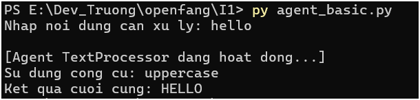
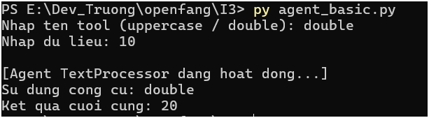

# I6 — Nguyễn Đang Trường — Tài liệu Hướng dẫn: Agent Cơ bản (OpenFang)

### Agent Cơ bản là gì?
Tài liệu này mô tả cấu trúc và cách vận hành của Agent cơ bản được xây dựng trong giai đoạn tìm hiểu framework **OpenFang**. Agent đóng vai trò là bộ não điều phối các công cụ (tools) để xử lý yêu cầu từ người dùng.

Hệ thống được thiết kế theo hướng linh hoạt, cho phép mở rộng thêm công cụ mới mà không cần sửa đổi cấu trúc cốt lõi của Agent.

### Cấu trúc mã nguồn (2 thành phần chính)
Hệ thống được tổ chức để tối ưu hóa khả năng điều phối:

1. **Class Agent:** Thành phần quản lý thông tin định danh và danh sách công cụ được phép sử dụng.
2. **Cơ chế điều phối:** Sử dụng `dictionary` để ánh xạ giữa tên gọi công cụ và hàm xử lý (function). 

### Danh sách công cụ (Tools)
| Tên Tool | Chức năng | Đầu vào (Input) |
| :--- | :--- | :--- |
| **uppercase** | Chuyển văn bản thành chữ in hoa | String |
| **double** | Nhân đôi giá trị đầu vào | Integer/String số |

### Hướng dẫn vận hành
Để Agent hoạt động, quy trình thực thi được thực hiện theo các bước:

1. **Di chuyển vào thư mục:** `cd openfang/I1`
2. **Thực thi chương trình:** `python agent_basic.py` (Lưu ý: Nếu gặp lỗi "Python was not found", hãy thử thay bằng lệnh `py agent_basic.py`).
3. **Làm theo hướng dẫn:** Nhập tên tool -> Nhập dữ liệu cần xử lý.
    

    
---

### Nhật ký lỗi & Giải pháp (ERRORS_LOG)
Quá trình triển khai Ngày 2 ghi nhận các vấn đề và giải pháp xử lý sau:

* **Lỗi 1: ModuleNotFoundError (Lỗi đường dẫn):** Không tìm thấy module `src.spikes`. Do cấu trúc repo hiện tại không đồng nhất với docs OpenFang.
    * **Giải pháp:** Loại bỏ các dòng import phụ thuộc không cần thiết và định nghĩa trực tiếp cấu trúc Agent bên trong file thực thi.
* **Lỗi 2: KeyError / Tool Not Found:** Agent không phản hồi khi nhập tên công cụ không tồn tại hoặc không khớp hoàn toàn với Key đã đăng ký.
    * **Giải pháp:** Kiểm tra tính nhất quán giữa tên công cụ và key trong dictionary `tools`.
* **Lỗi 3: ValueError (Ép kiểu dữ liệu):** Chương trình dừng đột ngột khi nhập ký tự không phải số vào công cụ `double`.
    * **Giải pháp:** Cần bổ sung các bước kiểm tra (validation) dữ liệu đầu vào trong các phiên bản cập nhật.

### Tóm tắt ngắn (3-5 dòng cho team):
> **Agent Cơ bản** trong OpenFang là bộ não điều phối công cụ thông qua Class Agent và Dictionary. Hệ thống hiện trang bị 2 công cụ chính là `uppercase` và `double`. Trong quá trình vận hành, cần lưu ý xử lý các lỗi về đường dẫn module, tính nhất quán của Key định danh và ép kiểu dữ liệu để đảm bảo Agent hoạt động ổn định.

---
*Ghi chú bởi: I6 — Nguyễn Đang Trường | Ngày 2 — Thứ Ba*