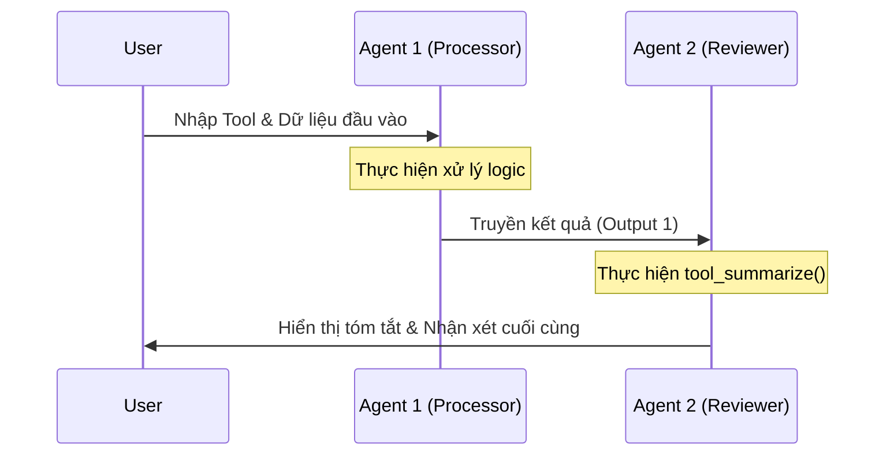

# I6 — Nguyễn Đang Trường — Technical Design Note: Phối hợp đa Agent (OpenFang)

### Phối hợp Đa Agent là gì?
Tài liệu này mô tả thiết kế kỹ thuật cho việc kết nối các Agent độc lập thành một chuỗi xử lý tự động (Multi-Agent Workflow) trong framework **OpenFang**. Mục tiêu trọng tâm là hiện thực hóa khả năng giao tiếp liên Agent, nơi kết quả đầu ra của thực thể này đóng vai trò là dữ liệu đầu vào cho thực thể tiếp theo.

Thiết kế này chuyển đổi hệ thống từ tương tác đơn lẻ sang mô hình **Sequential Pipeline**, giúp tối ưu hóa quy trình làm việc và đảm bảo tính mạch lạc trong chuỗi cung ứng thông tin.

### Quy trình vận hành & Kiểm thử (Giai đoạn nâng cao)
Quy trình này tập trung vào việc khớp nối các module đơn lẻ thành một hệ thống hợp nhất:

1. **Vận hành Pipeline (Ngày 4):** Kết nối Agent 1 và Agent 2. Dữ liệu sau khi được Processor xử lý sẽ tự động chuyển sang Reviewer để tóm tắt mà không cần sự can thiệp thủ công của người dùng.
2. **Kiểm thử tích hợp:** Xác nhận luồng truyền tin (Data Passing) giữa các file `agent_basic.py` và `agent_second.py` hoạt động ổn định, không bị lỗi định dạng dữ liệu.

**Sơ đồ luồng đơn giản:**
`Input` → **Agent 1 (Processor)** → **Agent 2 (Reviewer)** → `Output`

---

### Phân loại các thành phần & Chức năng

| Thành phần | Chức năng / Vai trò | Công cụ sử dụng (Tools) | Đặc tả kỹ thuật |
| :--- | :--- | :--- | :--- |
| **Agent 1 (Processor)** | Xử lý dữ liệu thô | `uppercase`, `double` | Thực hiện biến đổi logic từ input người dùng. |
| **Agent 2 (Reviewer)** | Đánh giá & Tóm tắt | `tool_summarize` | Nhận output từ Agent 1 để tinh gọn thông tin. |

#### Mô tả Chi tiết Reviewer Agent (I1)
Agent này đóng vai trò là lớp kiểm duyệt cuối cùng trong pipeline. Nhiệm vụ chính là nhận văn bản đã qua xử lý và đưa ra đánh giá ngắn gọn hoặc bản tóm tắt súc tích để người dùng dễ dàng nắm bắt kết quả mà không cần đọc toàn bộ dữ liệu thô.

#### Mô tả Chi tiết tool_summarize
Đây là công cụ hỗ trợ cho Reviewer Agent với logic xử lý cụ thể:
- **Chức năng:** Tóm tắt văn bản tự động.
- **Cơ chế:** Nhận một đoạn văn bản dài, thực hiện tách chuỗi dựa trên dấu chấm đầu tiên (`.split(".")[0]`) để lấy ra câu chủ đề chính.
- **Đầu ra:** Trả về một chuỗi văn bản đã được tinh lọc, đảm bảo tính ngắn gọn và trực quan.

---

### Chi tiết thiết kế hệ thống (Design Details)

* **Cơ chế truyền dữ liệu (Data Passing):** Kết quả của Agent 1 được ép kiểu thành `string` trước khi chuyển sang cho Agent 2. Điều này đảm bảo tính tương thích tuyệt đối cho công cụ tóm tắt văn bản.
* **Sơ đồ trình tự (Sequence Diagram):**

* **Kiểm soát logic (Condition Handling):** Hệ thống tích hợp bộ lọc điều kiện chặt chẽ. Nếu Agent 1 gặp lỗi thực thi (trả về `None`), Pipeline sẽ tự động ngắt để bảo vệ Agent 2 khỏi việc xử lý dữ liệu lỗi.

---

### Nhật ký lỗi & Giải pháp (ERRORS_LOG)

* **Lỗi 1: Type Error (Định dạng):** Agent 2 không đọc được kết quả nếu Agent 1 trả về kiểu số (int).
* **Giải pháp:** Sử dụng `str()` để đồng nhất mọi output của Agent 1 về dạng văn bản trước khi truyền đi.

* **Lỗi 2: Lỗi Import (Path):** Không nhận diện được `Reviewer` khi chạy file main từ thư mục khác.
* **Giải pháp:** Sử dụng đường dẫn import chính xác `from agent_second import Reviewer`.

* **Lỗi 3: Logic Halt (Ngắt luồng):** Reviewer vẫn chạy dù Agent 1 báo lỗi "Tool không tồn tại".
* **Giải pháp:** Thêm kiểm tra điều kiện `if output_agent1:` trước khi gọi Agent 2.

---

### Tóm tắt ngắn (3-5 dòng cho team):

> Hệ thống **Multi-Agent Workflow** đã hoàn thành việc tích hợp luồng tuần tự giữa Processor và Reviewer. Cơ chế truyền nhận dữ liệu đã được tối ưu hóa và kiểm soát lỗi tự động đạt độ ổn định cao. Nhóm cần chú ý duy trì cấu trúc file đồng nhất để chuẩn bị tốt nhất cho buổi Demo cuối tuần.

---

**Ghi chú bởi:** I6 — Nguyễn Đang Trường | **Cập nhật lần cuối:** Ngày 4 — Thứ Năm
