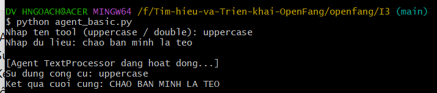
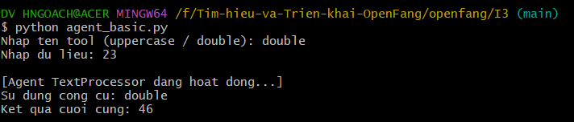
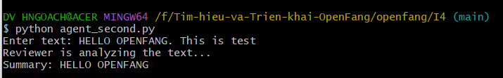
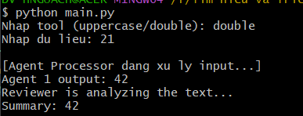
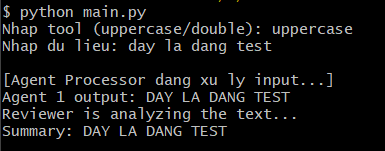
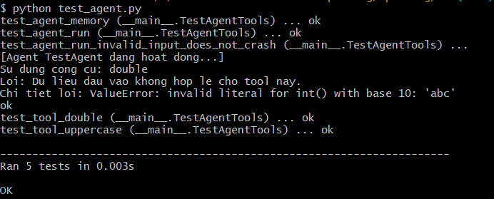
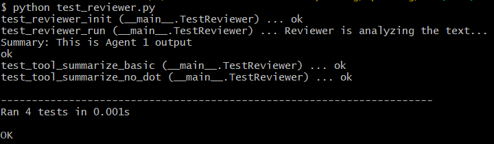
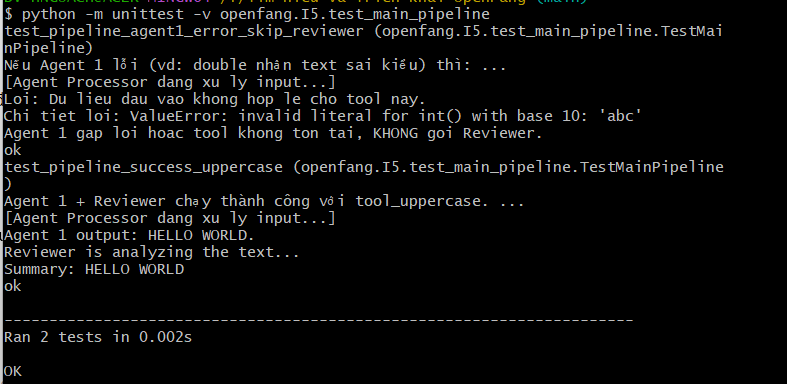

# Hướng dẫn chạy các file test - Ngày 4

## Chuẩn bị
1. Mở Git Bash tại thư mục gốc dự án
```bash
cd Tim-hieu-va-Trien-khai-OpenFang/openfang
```

---

## BƯỚC 1: Test Agent 1 (I1 + I2) - Agent cơ bản

### Chạy chương trình:
```bash
cd I3
python agent_basic.py
```

### Kết quả mong đợi:

**Test tool uppercase:**
```
Nhap ten tool (uppercase / double): uppercase
Nhap du lieu: hello openfang

[Agent TextProcessor dang hoat dong...]
Su dung cong cu: uppercase
Ket qua cuoi cung: HELLO OPENFANG
```


**Test tool double:**
```
Nhap ten tool (uppercase / double): double
Nhap du lieu: 21

[Agent TextProcessor dang hoat dong...]
Su dung cong cu: double
Ket qua cuoi cung: 42
```


✅ Agent 1 hoạt động đúng với 2 tools

---

## BƯỚC 2: Test Agent 2 (Reviewer)

### Chạy chương trình:
```bash
python agent_second.py
```

### Kết quả:


✅ tool_summarize hoạt động đúng  
✅ Reviewer.run() hoạt động đúng  
✅ Test riêng Agent 2 → PASS

---

## BƯỚC 3: Test Agent I4 (Phạm Quốc Đạt)

### Chạy chương trình:
```bash
cd ..
python I4/agent_basic_I4.py
```

### Kết quả test tự động:

**Test 1 - Tool uppercase:**
```
[TEST 1] Goi tool_uppercase:

[Agent TextProcessor dang hoat dong...]
Su dung cong cu: uppercase
Ket qua cuoi cung: HELLO OPENFANG
```
✅ Agent gọi đúng tool và xử lý chuỗi thành chữ in hoa

**Test 2 - Tool double:**
```
[TEST 2] Goi tool_double:

[Agent TextProcessor dang hoat dong...]
Su dung cong cu: double
Ket qua cuoi cung: 42
```
✅ Agent thực hiện phép nhân đôi số

**Test 3 - Tool không tồn tại:**
```
[TEST 3] Goi tool khong ton tai:

Loi: khong tim thay cong cu 'unknown_tool' trong he thong!
Cac tool co san: ['uppercase', 'double']
```
✅ Agent phát hiện tool không tồn tại và hiển thị danh sách tool hợp lệ

**Test 4 - Nhập dữ liệu thủ công:**
```
Nhap ten tool (uppercase / double): uppercase
Nhap du lieu: chao ban minh la tep

[Agent TextProcessor dang hoat dong...]
Su dung cong cu: uppercase
Ket qua cuoi cung: CHAO BAN MINH LA TEP
```
✅ Agent xử lý đúng dữ liệu người dùng nhập

---

## BƯỚC 4: Test file main.py

### Chạy chương trình:
```bash
python main.py
```

**Tool uppercase:**


**Tool double:**


✅ Main pipeline hoạt động đúng

---

## BƯỚC 5: Test Agent riêng lẻ

### Test Agent 1:
```bash
python test_agent.py
```


### Test Reviewer:
```bash
python test_reviewer.py
```


✅ Cả 2 agents đều pass test

---

## BƯỚC 6: Test I5 (Pipeline tích hợp)

### Chạy test:
```bash
cd F:\Tim-hieu-va-Trien-khai-OpenFang
# Chuột phải -> Git Bash Here
python -m unittest -v openfang.I5.test_main_pipeline
```

### Kết quả:


✅ Pipeline hoạt động đúng  
✅ 2 agents phối hợp nhau thành công

---

## Tóm tắt kết quả Ngày 4

| Test | Trạng thái | Ghi chú |
|------|-----------|---------|
| Agent 1 (I3) | ✅ PASS | 2 tools hoạt động đúng |
| Agent 2 (Reviewer) | ✅ PASS | Tool summarize OK |
| Agent I4 | ✅ PASS | Test tự động + thủ công |
| Main.py | ✅ PASS | Pipeline chạy đúng |
| Test riêng lẻ | ✅ PASS | Cả 2 agents OK |
| Pipeline I5 | ✅ PASS | 2 agents phối hợp nhau |

**Kết luận:** Tất cả tests đều PASS. Hệ thống 2 agents phối hợp hoạt động ổn định.
